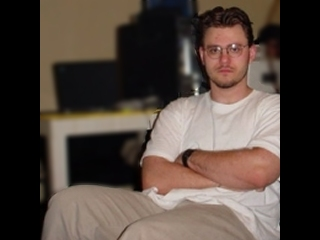

---
tags:
    - Veteran Member
    - LanpartyGoDS
---

# Abysal

## Veteran Member

### Personal Input

I like to play many RTS games such as : Starcraft : Brood Wars, AOE2 : Expansion, and Homeworld. I like first person shooters, such as UT and Quake3 (which I am god when i play), I also like Counter Strike (a mod for Half-Life - awsome), and of course the best space sim / first person shooter : FreeSpace2. Other then playing games, my other hobbies are networking, and building computers. I have gotten into a real bad habit of constantly upgrading my hardware to maintain a faster machine.

### Quotes
1. I know how to use a keyboard now!
2. Damn you Fluxy!
3. You don't exist!
4. Reality is the essance of thought.
5. Don't cry about it bitch!

### Computer Specs

| Type          | / | Spec as of 2001                        |
| :-----------  | - | :------------------------------------: |
| CPU MHZ @ FSB | = | Athlon ThunderBird 1533 Mhz |
| Memory        | = | 768Mb PC2100 DDR |
| OS            | = | Windows XP Professional |
| Video Card    | = | Hercules 3D Prophet III GeForce3 64Mb DDR|
| Monitor       | = | NEC FE950+ (Black) 19"  |
| Network Card  | = | |
