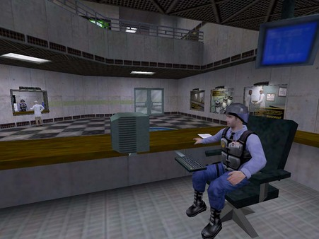
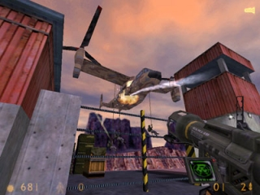
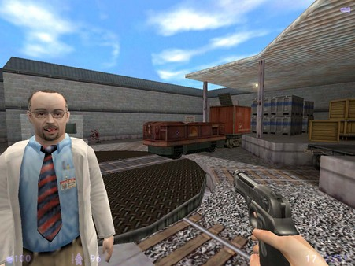
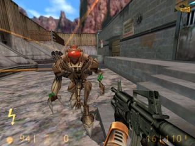
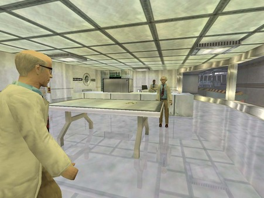
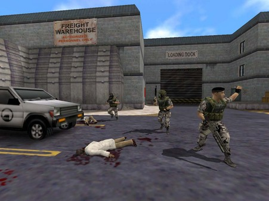
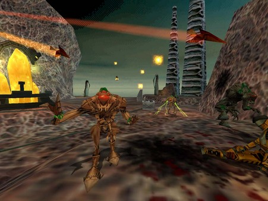

---
date:
    created: 2001-12-12
    updated: 2001-12-13
categories:
    - Game
    - Review
tags:
    - game
    - review
authors:
    - cybrwlf
---

# Half-Life: Blue Shift

Half-Life: Blue Shift is a first-person shooter sci-fi game featuring a security guard's perspective of the Black Mesa incident. Powered by the GoldSrc engine. Release date - June 12, 2001. Developer: Gearbox Software | Publisher: Sierra Studios

Reviewer: [CybrWlf](../authors/cybrwlf/)

<!-- more -->

## Introduction

### Belay that order! Update - 12/13/01
What we have here is a failure to comunicate!
Apparently Blue shit is not meant to be taken as a full blown title but more of a "... we let you play the scientest (Half Life) and the military (Opposing Forces) we might as well finish it up by letting you play the security guard (Blue Shift) ..." type thing. So maybe I was a bit harsh but still a new title is a new title and should not let players down so badly. I'm leaving the review as it stands for that reason. But I'll try and play Opposing Forces and review that when I'm done... Just hope it's NOT in a few hours.

### Orginal Intro
The Academy never prepared you for this... That is the understatement of the year! This is the shortest game that I have ever played!!! I know it's tough to come out with story lines for FPS... only so many ways to say,"Shoot everybody and don't die." This game is based on a great game called Half Life where you run around as a scientest trying to save the world after an experiment goes severly wrong. Now this is a hard act to follow of course, but they could have done a little better story which is basicly to save your ass, a Black Mesa security guard, and the few scientest needed to acieve that objective.

## Requirements

1. Minimum Required
    * Windows© 95/98/NT/2000/ME
    * Intel Pentium® 233 or AMD K6® -2
    * 32 MB RAM
    * 400 MB HD Space
    * 2x CD ROM Drive
    * SVGA, high-color (16-bit)
    * Win-compatible Soundcard

## Stability

**Rate: 8** 

Well no one can fault them on the engine they decided to use. The HalfLife is a very stable engine and Mods are plentiful so you can see the true versitility in the engine. I did have some issues when playing thou. Mostly when on the lifts or when crouching and crawling threw TIGHT parts of the game I noticed that you would get "stuck" in place. Now if this is only aproblem with just my PC.. ok . If others have the same issues then I have to wonder what they did to the game to cause such a specific problem.

 
 
## ReUseability

**Rate: 6**
 	"Half-Life: Blue Shift also contains Half-Life: Opposing Force, the award winning episode that casts you as one of the military specialists assigned to eliminate Gordon Freeman." This is the only thing that can save this game. Though I'm sure it's just like the mods and such so if you already have them, don't bother.

  

## Compatability

**Rate: 8** 
Well just look at the min req... It looks like it would run on almost anything. You would think ... Check out Grafix for more details into this comment.

 

## Grafix

**Rate: 7* 
Now you read the Min req right? Well as you can tell by my PC specs, I have a more then half decent Video Card. A Geforce 2 Pro is nothing to sneeze at right? Well I had odd video probs. Direct3d would act up if hit the ESC button to get to the main menu. It would not return to the game and show you the screen.Weird but not the end of the world... Open GL Allows you access back and forth but there would be odd anomilies in game. Doors that are raise (opened) could sometimes be seen threw the wall. Blast marks from a distant looked like a glitch in the game untill you get closer. Software runs as predicted. Now don't get me wrong... The New HD models and all are always nice eye candy but only if you don't notice these other problems. Good luck!

## FX
**Rate: 8** 
Don't expect anything more then what you get from Half Life. The "Blow torches cutting doors open" scenes are neat, I'm sure they just manipulated something already in the game. The HD models and textures are nice.. but that's it. They utilized steam, heat, and checmial damage more then the orginal but it was all there the first time round too.

 

## Network
**Rate: 9** 
Well it's still 32 player and I'm sure it play just like any HL mod.

 

## Overall
**Rate: 7.6** 
TOO damn short!!! Again I know it a little tough with Freeman's story in place, but they could have done something... Off the top of my head, they could have elongated the game by making the first half of the game a Lock down and prevent things from getting outside. Maybe delve a little into preventing Freeman from escaping and watching him from a view screen, maybe. Going into the story a little more about the "Administrator" for a bit. And then after they realize that the military are out to destroy "EVERYTHING"(maybe over hear orders being given by the admin to a soldier) in Black Mesa, then the second half could have been a save as many people as you can. They could have done a lot more if they wanted too.

 

## Conclusion
If you don't mind being angry with yourself that your brand new copy of Blue Shift has only taken you a couple hours to complete, then by almeans buy it. I think the story could have been done better and answered some questions with out messing up the classic story of HL.

You have a few hours to kill.

Don't care for a complex story.

Then this is your kinda game!

I on the other hand hope that someone makes a mod for this game that goes deeper into the story rather then take the easy way out of "just escape".

 <!--    -->