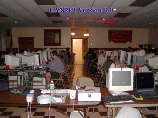
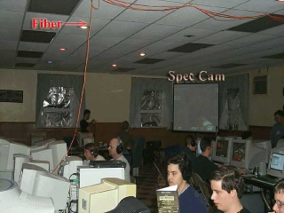
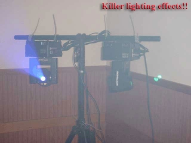

---
date:
    created: 2002-10-10
    
categories:
    - Lanparty
    - Review
tags:
    - lanparty
    - review
authors:
    - cybrwlf
---

# Cramped Combat E1

Cramped Combat E1. Date - Oct 10, 2002.

Reviewer: [CybrWlf](../authors/cybrwlf/)

<!-- more -->

## Introduction

Cramped Lan. Sounds uncomfortable but it was suprizingly spacious. The name came from the original location in which REAL cramped. It could have gotten cramped but we had quite enough room even though.

## Requirements

1. Minimum Required
    * PC with NIC and extra space on HD (approx 4GB free)
2. Recommended
    * PC with NIC and games loaded already

## Stability

**Rate: 8.5** 

Everything was good. No fights, arguments or anything... well except for which game to play next.

 
 
## ReUseability

**Rate: 9**

This was very fun. It was just a bunch of guys playin and having fun. The food was definatly a nice touch but I'm sure it got expensive for the host. I would definately come back even if they don't offer the food.

  

## Compatability

**Rate: 9** 

Definately an open atmosphere. I liked the fact that we were not banished to a basement and reminded to "keep it down". We were in the heart of the house (dining area, spilling into the kitchen) and not once did anyone tell me to keep it down. Now normaly I would not be offended even IF they did tell me to lower my voice, because I do know I am naturally very loud.

 

## Grafix

**Rate: 5**

n/a

## FX

**Rate: 9** 

I didn't find this out till later in the lanparty but a laptop with a simple web cam was recording pix every minute. It's a simple idea but I like it ... It's not novel, Lan2k1 did it before... It's not very Hi-Tech... but you know what ... It's a cool idea and I like it ... always have and always will.

## Network

**Rate: 8.5**

Network was fine. Internet Access was a nice touch and was bearly abused, which is always good. I would recommend a few dedicated servers but otherwise it was fine.

## Overall

**Rate: 9** 

The Lan Was great. The people and atmosphere were good too. When you have all this it's hard to not have a good time.

 

## Conclusion

I can't wait till there is another lan like this. It was just more fun.

 