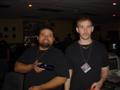
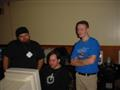
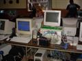
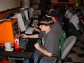
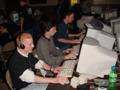

---
date:
    created: 2002-03-28
    
categories:
    - Lanparty
    - Review
tags:
    - lanparty
    - review
authors:
    - cybrwlf
    - doomxexec311
    - cyberfirex
    - abysal
---

# LAN2K1 v4.0

LAN2K1 v4.0 is the 4th iteration . Powered by the GoldSrc engine. Release date - June 12, 2001. Developer: Gearbox Software | Publisher: Sierra Studios

Reviewer: [CybrWlf](../authors/cybrwlf/)

<!-- more -->

## Introduction

BIGGER. BETTER. DA BOMB!!!
This is the second time me and Abysal went to Lan2k1 and it just gets better each time. Well this time we brought backup. 12 of us were there and we showed them what it means to be a GOD!!! Since so many GODS showed up I decided to get some input from them too.

## Requirements

1. Minimum Required
    * PC with NIC and extra space on HD (approx 4GB free)
2. Recommended
    * PC with NIC and games loaded already

## Stability

**Rate: 9** 

3 parties, 60+ people ( I dunno if we ever got a FINAL count of how many), and WHOLE HECK OF ALOT OF BAWLS!!! We can be as loud as we want... never have to worry about being crowded... and frag and frag to our little hearts content. This place is great but I really think we are begining to see the max possiblity of this location. Not to say 60+ isn't a good number but I dunno where they are gonna put people, let alone get power for them.

 
 
## ReUseability

**Rate: 8.9**
### -DoomXexec311-

Yo, I had a great time at this LAN. Was expecting more competition plus more tournaments to occur but they all didn't due to time. Anyhow it was great owning it up :) I'm glad I won the p4 chip and mobo.... muwhaha. Till next LAN hopefully more tournaments will happen. Can't wait >:)

### -CyberFireX-

I would definitely come back to lan 2k1. There was a lot going on and always 2 or 3 different games to play. There were lots of cool people. A couple of annoying people, but that's to be expected. I definitely would recommend it to everyone. Just a tip though, treat your stuff as if you were leaving it out on the sidewalk, this is a public event not a friendly one. Keep an eye on everything, and don't leave your stuff lying about.

  

## Compatability

**Rate: 8** 
Well it was bound to happen. The more people you add to the mix the more of a chance that 1 of them will piss someone off. Luckly it was handled very quietly and I believe all in volved realized what they did wasnot the best thing to do. For those not in the know... Don't worry about it. It was nothing, just keep in mind that this is a big even and people from all over attend these. It's not a party of friends and what you think is funny might piss someone else off.

 

## Grafix

**Rate: 9* 
The projection screen made a come back and was nice to watch. No Fog or Disco lights which was good.

## FX
**Rate: 8** 
Everything was fine, UNTIL... (Blinding light!!!) Yep some one managed to find the light switch and take down half the GODS crew. I know we were kicking some butt, but come one... there has got to be a better way to beat us without blowing a circuit breaker. Just kidding!!!

### -CyberFireX-

The prizes were awesome, and the raffle was a good idea. The fact that he gave away the best prizes as raffles meant that the games were more for fun than bitter competition. The observer view screen was a great idea, it let people watch the battle without crowding the gamers. The network was great. My only real complaint was that the microphone they were using was highly inadequate, they should consider putting speakers around the room for that, or multiple boxes, and doing rogerwilco. They had a great idea with posting an intranet webpage, and putting common drivers, and game patches up there so that everyone could get to them.

 

## Network
**Rate: 9.5** 
As usual an impressive setup. Fiber uplinks were nice but we noticed that the 3 Switches were not in use, only 2. Dunno what happened... not sure anyone really does but it's just an observasion. In LAN2k1's defense they ran good old CAT5 to the GODS section and all was good. The "overflow" area(I think it was up front) made good use of my 16 port switch. I was happy to help. OH speaking of HELP. I met some great guys at Lan2k1... Why? cause they were haveing some problems getting connected. While I don't mind helping (and these guys were great guys to hang with too) I do get just a little upset when people don't test their hardware. The problem boiled down to a bad Cat5 cable they brought from home. Like I said I didn't mind helping but please... PLEASE!!!.... check your stuff BEFORE you come to a party. It saves time and you'll get into the game faster.

 

## Overall
**Rate: 10** 
### -=AbysaL=-
I love lan parties, I can't imagine how boring my life would be with out them. I've been to Lan parties before, but I gotta say, lan2k1 throws the best ones! Especially this time around, there was food, plenty of drinks, and tons, tons of gaming! Can it really get any better then this? My friends and I also host lan parties on a monthly basis, and I hope that one day we can put something togther like lan2k1 did. Great job lan2k1!

 

## Conclusion
I'm glad 8-Ball made an apperance, dunno if it would have been the same with out him. Well Lan2k1 has done it again. I hope they keep doing it too for years to come. Games, Tourneys, Meatballs (which were great)... we got it all and Bawls to wash it all down. Can't wait till v5.0 AND the big party at Greenfields Fire Hall (Watch for it on LAN2k1's site). I'll see ya at the next lanparty!

   