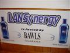
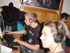
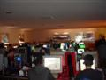
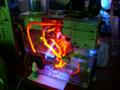
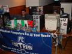
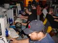
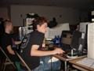
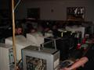
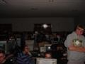

---
date:
    created: 2001-11-12
    
categories:
    - Lanparty
    - Review
tags:
    - lanparty
    - review
authors:
    - cybrwlf
---

# LAN2K1 v3

LAN2K1 v3 is the 3th iteration . Date - Nov 12, 2001.

Reviewer: [CybrWlf](../authors/cybrwlf/)

<!-- more -->

## Introduction

This is our review of Lan2k1 lanparty. This is also our first lanparty visited as a group (even though it was only me and Abysal). Orgianlly it was to be a trio but Flux had some last minute obligation to do. It was his loss as you will soon read. This is also serves as a test of our SEMI-Generic review system on our web page. If something is not EXACTLY catogorize please bear with me, I'll be making modifications as I go.

## Requirements

1. Minimum Required
    * PC with NIC and extra space on HD (approx 4GB free)
2. Recommended
    * PC with NIC and games loaded already

## Stability

**Rate: 9** 

Well the last 2 parties are at the same location and that is a good indication for stability. There is no indication that it's going anywhere soon which is always good.

 
  
## ReUseability

**Rate: 9.9**

This was such a good party that I am definately going back. I had the best time cause of several factors; atmosphere, attitudes, games played, and amount of players. Since most of the parties happen ever 3 months or so I'm sure everyone will have enough time to reschedual for it. Check Lan2K1 for details about the next party.

 

## Compatability

**Rate: 9** 

Atmosphere: I kinda liked the lights but the EM field effected a couple monitors nearby. Attitudes: Everybody there was helpfull, patches and maps were flying back and forth. There was just great attitudes all around. Games Played: We did manage to slip in a game of AoE2 but 99.9% of the time was a frag-fest. For those who don't know me I normally prefer RTS to FPS... for me to RAVE about this party you know it had to be fun. Amount of Players:42 Gamers! 42!! It was great ... confusion? not really .. once your plugged in you just look for a server and trust me you found one. Events were also schedualled for those who needed more regimin in their parties.
 
 

## Grafix

**Rate: 8.5* 

We had a 70"x70" projection screen for the spectator cam that doubled for a movie screen late at night, Charlies Angels on big screen never looked so good.	

## FX

**Rate: 8** 

The light show was a bust for me cause it caused distortions in near by monitors but it still a cool idea if placed some where away from PCs. The fog machine... I dunno ... it was funny walking into the kitchen only to see smoke coming from it, but on the other hand it was more of a distraction and cause quite a few headaches amongst the people (what the hell do you put in that anyway?).

 

## Network

**Rate: 9.5**

Two 32 port, 3com 10/100 switches connected by fiber... oh and an 8 port, netgear 10/100 switche for the overflow. I do have to give proper props to Abysal, it was his switch we used. Pings were low and file transfer was SWEET!!!

 

## Overall

**Rate: 9** 

Damn! What can I say...it was fucking great!!! Don't get me wrong, I love our own parties but it was non stop since we got there and then a couple hours after we left! I don't think we could top that until we break the wall and go to rented space.
 
 

## Conclusion

The people were great, you'd think with 42 people you would have a clash or two but other then 8-ball talking shit to get people pumped there was not a people prob the whole time. Games... you name it it was played. I even seen someone playing an emulator of the arcade game Samuri Showdown. Red Faction, Counter Strike, Quake3, Unreal... Maps and mods you would not believe... heck we even played network Virtual Pool!!! It was DA BOMB!!! Definatly going back! I'll see you Lan2k1 v4.0 !!!

  