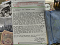
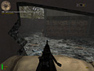
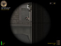
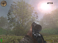
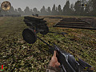
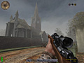
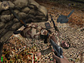
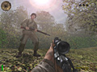
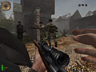
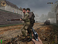

---
date:
    created: 2002-01-07
    updated: 2025-03-15
categories:
    - Game
    - Review
tags:
    - game
    - review
authors:
    - heller
---

# Medal of Honor - Allied Assault

Medal of Honor: Allied Assault is a WWII first-person shooter game featuring realistic combat missions. Powered by the id Tech 3 engine. Release date - January 22, 2002. Developer: 2015, Inc. | Publisher: Electronic Arts.

Reviewer: Heller

<!-- more -->

## Introduction

This is one game that every one had been raving about for a while. Personally just taking a quick peek at it it; I didn't see what all of the raving was about. I assumed it was the usual "war time" story line of being behind enemy lines and so forth. Well the story line is a bit interesting with a evil twist, apparently the Nazis are attempting to conjure forth and ancient evil, well I'll leave to rest for you to see. And of coarse by the looks of it, the game seems to use a slightly enhanced Quake III game engine. Well after deciding to take a deeper look at the game here is what I came up with...

## Requirements

1. Minimum Required
    * Windows XP, Windows Me, Windows 98, or Windows 95 (Windows 2000 and Windows NT are not supported)
    * 450 MHz Intel Pentium II or 500 MHz AMD Athlon processor
    * 128 MB RAM
    * 8x CD-ROM/DVD-ROM drive
    * 135 MB free hard disk space (additional space required for Windows swap-file, DirectX 8.0 installation)
    * 16 MB OpenGL capable video card using an Nvidia GeForce3, Nvidia GeForce2, Nvidia GeForce 256, Nvidia Riva TNT2, Nvidia Riva TNT, ATI Radeon, ATI Rage 128 Pro, ATI Rage 128, PowerVR3 Kyro II, or PowerVR Kyro chipset with OpenGL and DirectX 8.0 compatible driver
    * DirectX 8.0 compatible sound card
2. Recommended
    * 700 MHz or faster Intel Pentium III or AMD Athlon processor
    * 32 MB or greater supported OpenGL capable video card with OpenGL and DirectX 8.0 compatible driver

## Stability

**Rate: 10** 

I’ve played the demo for about 3 hours without incident. No graphics glitches, no sound problems, and the save game feature worked perfectly (the game allows you to save the game at any time, and will automatically save the game as you progress through the level). Also, load times were small - the entire level loaded at once and there weren’t any mid-level loads (think Half-Life). For such a large level, this is astonishing.

 
 
## ReUseability

**Rate: 7.5**
 I suggest playing the game on Hard the first time. It will give you a good sense of what crouching and leaning left and right brings to a Quake 3 powered WWII sim! After you complete the level, playing on Easy will give you increased numbers of enemies and lower personal damage (in other words, it’s Rambo time!). There will be about 10-12 multiplayer maps and 33 levels in solo-play in the released game.
 
 

## Compatability

**Rate: 9** 
My rig handled the demo without any glitches. Later NVidia, ATI and Matrox cards are all fully supported. Other cards will have various graphic corruption and frame rate problems.

 

## Grafix

**Rate: 9.5** 
Without a doubt, this game is the most beautiful Quake 3 powered game to date! The trees and bushes sway in the wind, there’s a lens flare effect when you look at the sun, the player models are highly detailed and the weapons are authentically rendered. One of the coolest new effects are splashes/rocket battery explosions (think a gigantic shower of mud, water or wood falling in front of you - cool!). The players even die differently, based on where they’re hit and the weapon used.

 

## FX
**Rate: 10** 
From the distinctive metal PING you hear when a bullet hits a tin roof, to the cinematic quality environmental audio, sound is an integral part of this game’s design! You can hear small arms fire and small BOOMs from far off explosions. If you run, your boots make more sound, alerting the enemy to your whereabouts. Walking in completely silent. The weapons have distinctive sounds, and since there’s a fairly small (but robust) amount of them, you can learn what an emeny is carrying when he opens up on you.

 

## Network
**Rate: 9** 
The multiplayer demo is out, and we played it fairly heavily at the January LAN party. Internet play is supported through GameSpy Arcade. One hint - if you play on-line, be sure and play on a server that only supports 8 or less people. Anything higher will generally yield a laggy game experience!

 

## Overall
**Rate: 9.5** 
The single player demo makes you hunger for the real thing! A movie of the Omaha beach level is available which will give you a better taste of what to expect. Excellent game play, beautiful graphics and astonishing sound make this demo shine. The only complaint you may have is that you can’t run very fast - 2015 is trying to make the experience as real as possible. Hint - if you switch to a small weapon (like the pistol or grenade) you will run a lot faster. Also make sure you’re not in crouch mode.

 

## Conclusion
You owe it to yourself to check out the single player demo. This game will hopefully turn into a LAN party favorite as more multiplayer maps are released. But for now, sniping bots in the single player demo will have to tie us over until later in January when the game is released.

   