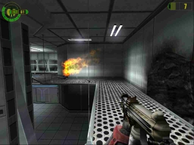
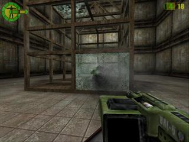
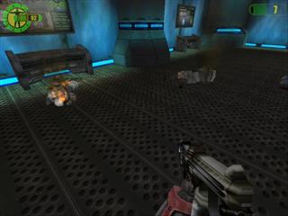

---
date:
    created: 2001-11-07
    updated: 2025-03-15
categories:
    - Game
    - Review
tags:
    - game
    - review
authors:
    - abysal
---

# Red Faction

Red Faction is a first-person shooter sci-fi game featuring destructible environments with Geo-Mod technology. Powered by the Geo-Mod engine. Release date – May 22, 2001. Developer: Volition, Inc. | Publisher: THQ.

Reviewer: [Abysal](../authors/abysal/)

<!-- more -->

## Introduction

Red Faction is a new game with a new feature that I'll be raving about for a while and it's called envionmental damage! Single player mode has a pretty good plot and it seems that the game can be completed via different "routes" taken through some of the levels. Multiplayer games support upto 32 poeple. Weapons are more realistic then Q3 or UT, and same goes for how ammo is done. You have to reload your weapon much like in Counter-Strike.

## Requirements

1. Minimum Required
    * K6-2 350 MHz
    * 64 MB Ram + OS and other Ram requirements
    * 1.2 GB HD space
    * For video you need a TNT or ATI Rage 128 type video Card with at least 16 MB Ram.
2. Recommended
    * Thunderbird / Duron / Pentium III @ 750 MHz
    * 128 MB Ram
    * GeForce, Radeon, Kryo II
    * a hard drive to accommodate 1.2 GB of game data.

## Stability

**Rate: 9** 

First off, games works right out of the box v.1.0 is stable and smooth. The v.1.10 patch also showed the same. I only experienced two crash instances where I was kicked to the desktop.

 
 
## ReUseability

**Rate: 7**
 There seem to be multiple routes to take through the levels. Also the way NPC's interact with you seems to vary.

  

## Compatability

**Rate: 9** 
Compatability looks real good, this game ran on every body's hardware here at LanParty 2000. And it was also pretty heavily played at LAN2k1, and I think 1 person may have had a problem with it running on his TNT2, I think the Nvidia Detonator drivers were to blame.

 

## Grafix

**Rate: 8* 
Graphics are what we all expect from games like UT and Quake 3.

<!--   -->

## FX
**Rate: 9** 
Environmental damage - 'nuff said.

 <!--  -->

## Network
**Rate: 9** 
The game uses TCP/IP for network play. The latency is great over LAN

 <!--  -->

## Overall
**Rate: 8** 
Great game, I highly recommend it for multi player gamming as well as going through the single player game.

 <!--  -->

## Conclusion
This is one of the new multi-player first person shooters that is a must try. The envionmental damage rocks! And one LAN I love to look at peoples faces when I blow the bridge out from under them :b Hopefully more future games will adopt envionmental damage.

 <!--    -->