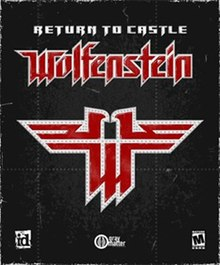
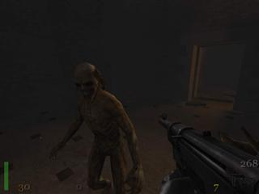
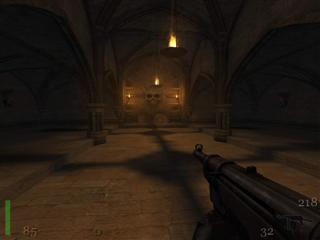
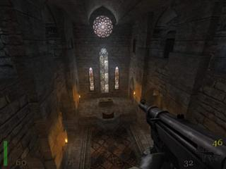
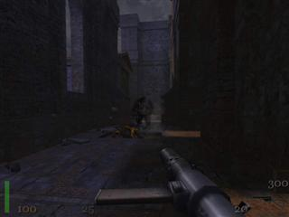
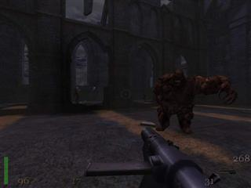
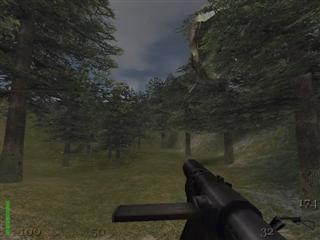
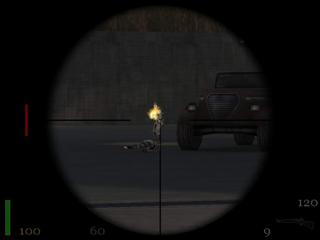
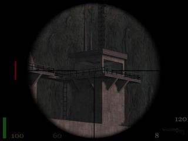
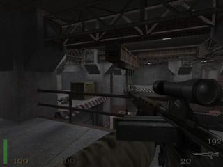

---
date:
    created: 2001-12-14
    updated: 2025-03-15
categories:
    - Game
    - Review
tags:
    - game
    - review
authors:
    - abysal
---

# Return to Castle Wolfenstein

Return to Castle Wolfenstein is a WWII occult action game featuring Nazi supernatural forces. Powered by the id Tech 3 engine. Release date - February 19, 2001. Developer: Gray Matter Interactive / Nerve Software | Publisher: Activision.

Reviewer: [Abysal](../authors/abysal/)

<!-- more -->

## Introduction

This is one game that every one had been raving about for a while. Personally just taking a quick peek at it it; I didn't see what all of the raving was about. I assumed it was the usual "war time" story line of being behind enemy lines and so forth. Well the story line is a bit interesting with a evil twist, apparently the Nazis are attempting to conjure forth and ancient evil, well I'll leave to rest for you to see. And of coarse by the looks of it, the game seems to use a slightly enhanced Quake III game engine. Well after deciding to take a deeper look at the game here is what I came up with...

## Requirements

1. Minimum Required
    * 3-D Hardware Accelerator (with 16 MB VRAM) with FULL OpenGL® support*
    * Pentium II® 400Mhz processor or Athlon® processor
    * Windows® 95 OSR2/98/ME/NT4.0(SP6)/2000(SP2)/XP Operating System
    * 128 MB RAM
    * 16-bit high color video mode
    * 800 MB of uncompressed hard disk space for game files, plus 300 MB for the Windows® swap file
    * A 100% Windows® 95 OSR2/98/ME/NT4.0(SP6)/2000(SP2)/XP compatible computer system (including compatible 32-bit drivers for CD-ROM drive, video card, sound card and input devices)
    * DirectX®8.0a (included)
    * 100% DirectX® 3.0 or higher compatible sound card and drivers
    * 100% Microsoft®-compatible mouse/keyboard and drivers
    * Quad-speed CD-ROM drive (600K/sec. sustained transfer rate)
2. Recommended
    * TNT2 or higher AGP 3D Graphics Card w/ 16 MB RAM
    * Athlon, Pentium III, Celeron 600 MHz or greater, Duron 600 MHz or greater
    * MS Windows OS 9x/2K/XP should be used for gaming to minimize compatibility issues
    * 128 MB System RAM should be the lowest
    * 800 MB Hard Drive space for the install, and 300 for virtual memory
    * A good 16-bit sound card is a must! SB 16, SB PCI 128, SB Live! (Value)
    * CD-Rom is really only used during the install, so if yours is slow as a snail dont worry

## Stability

**Rate: 9** 

As I mentioned in the Info, this game uses a slightly supped up Quake III engine. This game is a bit more memory hungry then Quake III, but looks a bit better. For playing the game on my system I saw no graphic anomalies, distortions, or errors.

 
 
## ReUseability

**Rate: 8**
 I would say the single player game is repayable at least a few times. This is because there are secrets on almost every level, so you might want to go through the game again more carefully and see if you can get them all, I liked this idea it was like something in many of ID's games.

  

## Compatability

**Rate: 9** 
Well like the Quake III engine, this game seems to run on almost anything, and giving you good performance. Although it is more hungry for RAM. There's not much more to say, if you are having problems I would try to get the WHQL certified device drivers for your hardware, especially for your graphics card.

 

## Grafix

**Rate: 9.5** 
This game has real sweet looking graphics, If you know me you know how much I favor the Quake III engine over UT, well this ones even better, It utilizes the Geforces' Texture and Lighting pretty well, adding great fog and fire effects. The game levels also have an astonigishly real life look and feel to them.

 

## FX
**Rate: 9.5** 
The game is loaded with details; On the second level there are suits of armor along this hallway.. very realistic looking. There are torches, fire places, which all add a great deal to the game experience, not to mention they all look real good. Oh, and the sound is spectacular!

 

## Network
**Rate: 8** 
Network multiplayer play is team based, much as in the Assault type game in Unreal Tournament. It is very enjoyable to play, although I must admit the only real testing of multiplayer mode was done with the demo of the game.

 

## Overall
**Rate: 9** 
This game looks like a winner. Good graphics and sound, a solid game engine, good multiplayer and single player.

 

## Conclusion
The story line is one that is more fictional, but that's actually what ended up attracting me to the game. It feels like DOOM or Quake when I play because I'm on the constant look out for secrets and monsters popping out. And some parts of the game go me a bit scared like in Aliens vs. Predator [I couldn't play that game..I'm a whimp :( ]. The part that gave me a real scare was the spiked pit in the Crypt, you'll know what I mean when you get there :)

   
 